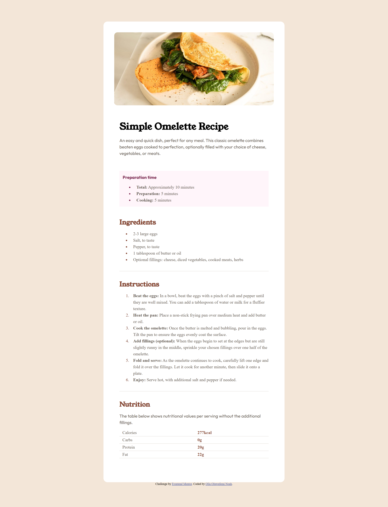
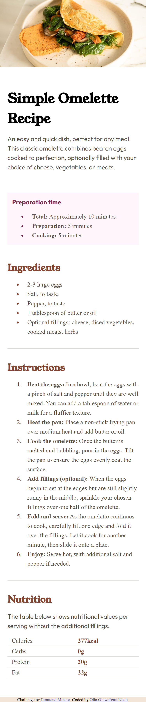

# Frontend Mentor - Social links profile solution

This is a solution to the [QR code component challenge on Frontend Mentor](https://www.frontendmentor.io/challenges/qr-code-component-iux_sIO_H). Frontend Mentor challenges help you improve your coding skills by building realistic projects. 

## Table of contents

- [Overview](#overview)
  - [Screenshot](#screenshot)
  - [Links](#links)
- [My process](#my-process)
  - [Built with](#built-with)
  - [What I learned](#what-i-learned)
  - [Continued development](#continued-development)
  - [Useful resources](#useful-resources)
- [Author](#author)


## Overview

### Screenshot






### Links

- Solution URL: [Solution URL here](https://github.com/oluwaseun145/Social-links-profile)
- Live Site URL: [Live site URL here](https://oluwaseun145.github.io/Social-links-profile/)

## My process

### Built with

- Semantic HTML5 markup
- CSS custom properties
- Flexbox
- Gridbox

### What I learned

I practiced centering a card using Flexbox, Gridbox and applying correct font weights and colors from a style guide.

```css
body {
  display: flex;
  justify-content: center;
  align-items: center;
  min-height: 100vh;
}
.container{
   display: grid;
   grid-template-columns: 1fr;
   align-items: center;
   justify-content: center;
   place-items: center;
   background-color: hsl(0, 0%, 12%);
   width: 320px;
   row-gap: 20px;
   padding: 10px;
   border-radius: 10px;
    
    
}

### Continued development

I want to keep improving my skills in:

Writing cleaner CSS

Using responsive units (rem/em instead of px)

### Useful resources

MDN Flexbox and Gridbox Guide
 – Helped me understand centering.

Frontend Mentor Slack
 – For community feedback.


## Author

- Website - [Olla Oluwafemi](https://oluwaseun145.github.io/Social-links-profile/)
- Frontend Mentor - [@oluwaseun145](https://www.frontendmentor.io/profile/oluwaseun145)


